# Problema 3 - Visualização de Objetos Implícitos

## Objetivo

Deve-se construir uma aplicação em *Python* que, dada uma função implícita de curva no espaço 2D, construa uma estrutura de dados que permita visualizar essa curva. A aplicação deve fornecer 3 formas de visualização:

1. A curva aproximada pela estrutura de subdivisão espacial, dada uma resolução;
2. A subdivisão espacial determinando a divisão do espaço em regiões internas, externas e de fronteira da curva;
3. A visualização da estrutura de dados desenhada em todos os seus níveis.

## Análise e planejamento acerca do problema
A utilização da TAD QuadTree já era prevista, pois no repositório do problema estava nítido a necessidade de seu uso. Nesse caso, foi necessário julgar e analisar quais adaptações eram necessárias fazer numa QuadTree comum para que se tornasse ideal para a resolução do problema.

O maior desafio do problema foi, na verdade, descobrir de qual maneira se pode julgar se a curva passa ou não por um retângulo por meio apenas de sua equação. Houve um pouco de demora pra solucionar esse impasse, mas certamente ele foi solucionado. Nesse caso, devia-se usar os conhecimentos da própria matemática na análise de gráficos de curvas no plano cartesiano. Temos que (x,y) arbitrários aplicados a equação nos retornaria valores positivos caso estivessem a direita da curva e valores negativos caso estivessem a esquerda da curva. Portanto, deve-se analisar as quatro extremidades de um retângulo, caso todas extremidades aplicadas a equação nos retorne valores negativos, sabemos que esse retângulo está totalmente a esquerda da curva, caso os valores sejam todos positivos, esse retângulo está totalmente a direita da curva, por fim, caso esses pontos aplicados a equação nos retornem valores com sinais opostos, sabemos então que a curva passa por aquele retângulo.

Por último, fez-se necessário fazer um estudo um pouco mais profundo acerca das peculiaridades do pyglet, para tal foi utilizada a documentação oficial. Houve um pouco de dificuldade pra entender como o *Batch()* funcionava, mas no final foi tudo esclarecido.

## Construção do código

1. Criou-se o módulo cRetangulo, a classe criada nesse módulo tem o intuito de simular retângulos por meio do pyglet. Para isso, dentro da classe temos um método que, usando o shapes do pyglet, pode retornar um *Rectangle* ou um *BorderedRectangle*. Além disso essa classe contém os métodos responsáveis por julgar se um ponto da curva implícita passa ou não pela área do retângulo.
   
2. Criou-se o módulo cQuadTree, esse módulo contém a classe que representa uma QuadTree. No caso das QuadTree, cada ramo da árvore tem 4 filhos e sua divisão, nessa aplicação, é feita de forma recursiva. Além disso, para o problema em questão, a QuadTree tem como um de seus atributos um Retangulo do módulo cRetangulo. Esse atributo é necessário, pois é a maneira que iremos representar os ramos dessa árvore de forma gráfica. Dito isto, podemos dizer que cada árvore é representada por um retângulo, os quatro filhos dessa árvore começam como *None* e, caso ocorra a divisão, os filhos da QuadTree pai são também QuadTree, isto é, cada Quadtree gera individualmente 4 filhos, sendo todos QuadTree também. Na aplicação em questão houve a necessidade de adicionar alguns métodos a mais à QuadTree para que ela funcionasse de maneira adequada. Temos 3 métodos que têm uma função semelhante e também funciona de forma semelhante. Esses métodos julgam quando há necessidade de divisão da QuadTree e qual imagem será exibida na janela, podendo ser a representação completa da TAD, a representação apenas da curva implícita ou a representação da divisão espacial externa e interna por meio da curva.
3. Os módulos cVetor e function foram criados. O primeiro é uma implementação simples de vetor para que não haja a necessidade de usar o que já vem nativo no *Python*. Já o segundo é um módulo que contém as equações de várias curvas implícitas e que tem uma função que retorna uma lista com cada uma dessas equações. Esses dois módulos são apenas auxiliares, sua necessidade não é extrema, mas torna o código mais organizado e simples de ser lido.
4. Por último o cWindow foi criado. Esse módulo diz respeito apenas a itens do pyglet. É nele que o gerenciamento de teclas e janela são feitos.

OBS: Comentários mais profundos acerca da construção do código estão no próprio código.

## Análise do uso de memória

Pelos testes realizados, o que mais consome memória nesse problema são as divisões que a QuadTree faz. Note que um pai gera quatro filhos, portanto se tivermos uma árvore com profundidade p = 10, temos um total de 4^10 de árvores totais (considerando que todas as subárvores também se dividam), pois os filhos também são QuadTree. Eu tomei liberdade de realizar alguns testes com diferentes configurações de refinamento (profundidade) da árvore.

O cenário ideal, tanto pra montagem da árvore quanto pra visualização da curva foi o de profundidade p variando entre 8-10, a depender da resolução utilizada. Nesse nível de profundidade temos uma imagem que representa nitidamente a TAD completa e de que maneira as suas divisões foram feitas, além de permitir uma visualização nítida da curva implícita.

Acerca dos testes de velocidade de montagem com diferentes refinamentos. A partir da profundidade igual a 11, houve um aumento perceptível de tempo com relação a montagem da TAD, algo que era praticamente instantâneo passou a demorar 0.5-1 segundo. Tomei a liberdade de tentar usar uma profundidade p igual a 20, nesse caso, houve uma demora imensa pra realizar a montagem e a montagem não conseguiu ser finalizada, já que a janela crashou e o terminal retornou uma mensagem de falta de memória RAM.

Dito isto, acerca do consumo propriamente de memória RAM. Após montar QuadTrees com todas as equações disponíveis e plotar a TAD inteira, a curva implícita e a divisão de espaço externo e interno, o consumo de RAM para uma árvore de profundidade igual a 10 não ultrapassou os 350mb. Por outro lado, no teste de profundidade igual a 20 o consumo chegou próximo dos 14GB de RAM até que crashou.

Logo, para essa aplicação, não há a necessidade de implementar o método *__del__*, pois nem sempre ele funciona, já que a autoridade máxima é o garbage collector, e pode acontecer dele se recusar a apagar o objeto. Além disso, criando um novo objeto (no caso, uma nova QuadTree) e atribuindo ela a mesma variável que estava a QuadTree antiga, a QuadTree antiga é suposta de ser deletada, pois como não há mais referência a ela no código, o garbage collector trata de apagá-la.

Por isso, nessa aplicação, o único candidato a consumir muita memória RAM é o nível máximo de divisões que a QuadTree pode fazer (nessa aplicação foi limitada a 10, dado os motivos já citados aqui).

Fazendo uma conta rápida acerca da suposta quantidade de dados que teríamos considerando QuadTrees de profundidade 10 e 20:

* profundidade 10 = 4^10 = 1.048.576
* profundidade 20 = 4^20 = 1.099.511.627.776

Nesse caso, temos um volume de dados 1.048.576 vezes maior, por isso o tempo pra montar a QuadTree aumenta, bem como o consumo de memória RAM.

Lembrando que esses números dizem respeito a divisão recursiva de todas as sub-árvores. No problema em questão, isso pode não ocorrer, pois caso seja identificado que a curva não passa pelo retângulo, aquele retângulo(representado por uma árvore) não se dividirá mais. Portanto esses números são apenas dados que dizem respeito a uma situação espécifica de divisão da árvore, que apesar de não acontecer no problema, serve pra termos uma ideia de como o volume de dados pode aumentar devido ao maiores graus de refinamento.

## Curvas implícitas utilizadas

OBS: Uma janela de resolução 400x400 foi utilizada para realizar essas fotos, no entanto as curvas ficam mais nítidas e contínuas ao utilizar resoluções como 1024x1024. Isso se deve pela fator de correção utilizado na conversão entre coordenadas.

OBS2: As funções estão dispostas na mesma ordem da aplicação, sua identificação é crescente da esquerda para direita, de cima para baixo.

| x³+y-4 = 0 | x⁴+y⁴-xy-8 = 0 | (x²+y²-4)³-x²y³ = 0 |
| :---: | :---: | :---: |
| 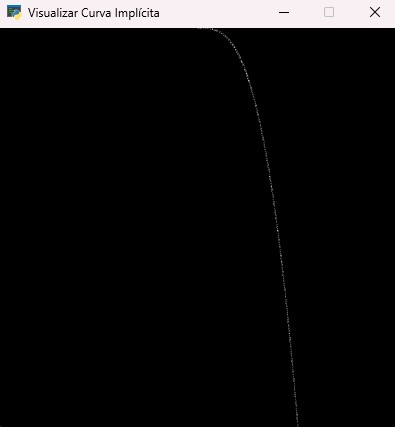 | 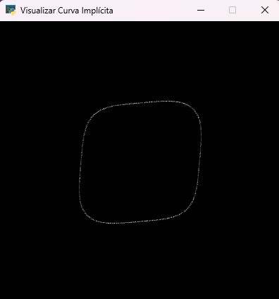 | 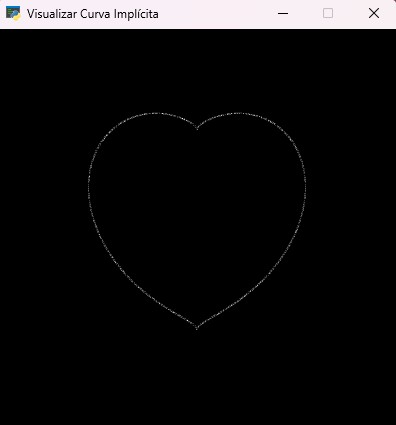 |

| x⁷-y⁵+x²y³-(xy)² = 0 | x²+y²+xy-(xy)²0.5-0.25 = 0 | abs(x)+abs(y)-2 = 0 |
| :---: | :---: | :---: |
| 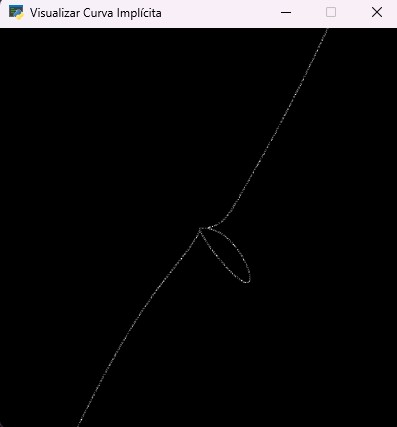 | 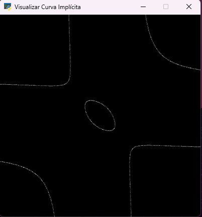 | 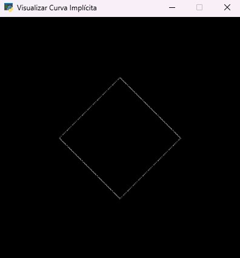 | 

| x³+y²-6xy = 0 | x³+y³-3xy = 0 | (3x²-y²)²y²-(x²+y²)⁴ = 0 |
| :---: | :---: | :---: |
| 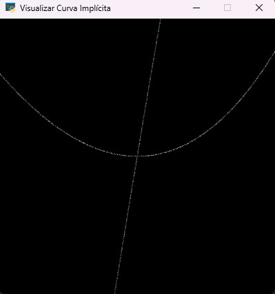 | 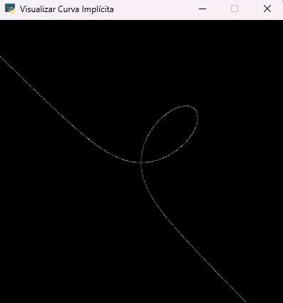 | 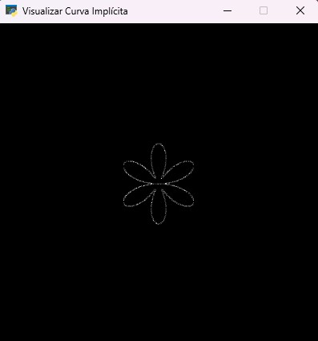 | 

| x²(4-x²)-y² = 0 | y³+y²-5y-x²+4 = 0 | (3x²-y²)y²-(x²+y²)⁴ = 0 |
| :---: | :---: | :---: |
| 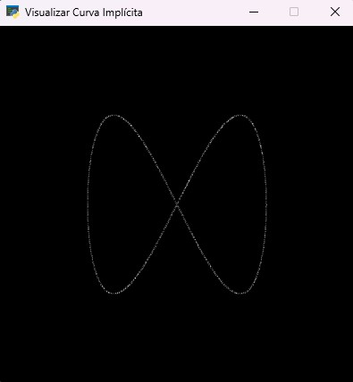 | 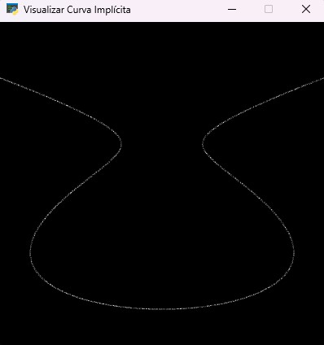 |  | 

## Guia de uso
* A princípio será necessário passar um argumento para que o código rode, esse argumento é igual ao nivel de refinamento inicial, portanto lembre-se que deve ser um valor entre 0-10.
* A aplicação só começa a ser responsiva após apertar a tecla P, portanto é ela quem deve ser pressionada primeiro ao rodar a aplicação. 
* A tecla P é responsável pela rotatividade das equações implícitas, cada vez que for pressionada ela vai alterar para a próxima equação das listas de equação, lembrando que funciona como uma lista circular.
* A tecla G mostra a visualização da TAD completa, em todos os seus níveis.
* A tecla Q mostra apenas a curva implícita.
* A tecla R mostra a divisão espacial interna e externa da curva.
* A tecla X aumenta o nível de refino (limite 10).
* A tecla Z diminui o nível de refino (limite 0).

## Recomendação de resolução e refinamento
* As imagens ficam mais nítidas em resoluções de potência de 2, no caso 2^n, sendo 0 <= n <= 10.
* As resoluções mais confortáveis são 512x512 com refinamento 9 e 1024x1024 com refinamento 10.
* A grande maioria dos monitores não suporta a resolução de 2048x2048, além disso o grau de refinamento deveria ser maior, necessitando de maiores quantidades de memória e maior tempo para plotagem das curvas.
* A resolução de 256x256 representa um quadrado muito pequeno, portanto eu recomendo apenas 512x512 ou 1024x1024.

## Referências bibliográficas
Wikipedia, **Implicit Surface**.https://en.wikipedia.org/wiki/Implicit_surface

pyglet. **pyglet Documentation**.https://pyglet.readthedocs.io/en/latest/

math.toronto. **math.toronto**.http://www.math.toronto.edu/courses/mat237y1/20199/notes/Chapter3/S3.2.html

Geogebra, **Geogebra**.https://www.geogebra.org/classic?lang=pt

ximera, **Implicit Curves and SurfacesMelissa Lynn**.https://ximera.osu.edu/mklynn2/multivariable/content/03_15_tangent_planes/tangent_planes

Shamshad, **Quadtree Algorithm for Implicit Curve Drawing**.http://shamshad-npti.github.io/implicit/curve/2015/10/08/Implicit-curve/

K.G Suffern,**Quadtree Algorithms for Contouring Functions of Two Variables**.https://academic.oup.com/comjnl/article/33/5/402/480353
